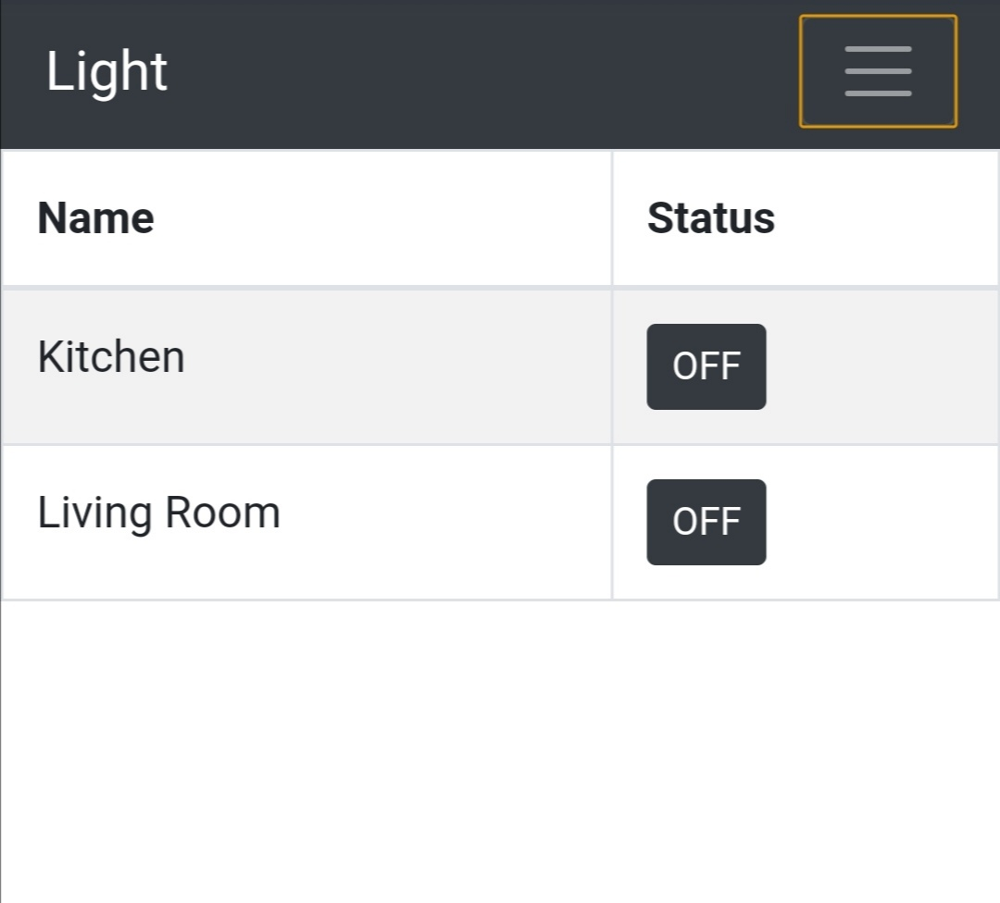

# Quarkus, Qute and Bootstrap
I was never really into web UI, I have zero javascript knowledge and I'm kind of proud of that :-)
But at some point it is helpful if one can just create a simple little web gui and when I read about Quarkus and Qute I wanted to give it a try. Read on for a quick tour of my first try-out app.

Qute is a server-side templating engine so it's quite the opposite of what vue.js and co. At the heart of Qute is the TemplateInstance, it returns HTML including your data, so you can basically adapt your jax-rs endpoint to return a TemplateInstance instead of a jx-rs response:
```java
    @Inject
    Template light;

    @GET
    @Produces(MediaType.TEXT_HTML)
    public TemplateInstance get() {
        List<Light> data = lightSensors.getAll();
        return light.data("light", data)
                .data("active", "Light");
    }
```

The code above implies you have an HTML template called light.html:
```html
<!DOCTYPE html>
{#include header.html}{/include}
<html>
<body>
    {#include navigation.html}{/include}
	<table class="table table-striped table-bordered">
	    <thead>
	        <tr>
                <th scope="col">Name</th>
                <th scope="col">Status</th>
            </tr>
        </thead>
        <tbody>
		{#for item in light}
		<tr>
			<td>{item.name}</td>
			<td class="fit">
                <form action="/light/{item.name}/toggle" method="POST" name="toggle-{item.name}" up-target=".container">
                    <input class="btn btn-dark btn-sm" value="{item.status}" type="submit">
                </form>
            </td>
		</tr>
		{/for}
		</tbody>
	</table>
</body>
</html>
```

The html file is enriched with some magic :-) 
1. I used bootstrap.js to make it look better ;-)
2. {#include header.html}{/include} --> make your html modular, include common stuff from another file
3. {#for item in light} --> access the data from your Java code

Interaction is easily done with form actions calling your jax-rs endpoint:
```html
<form action="/light/{item.name}/toggle" method="POST" ...>
```
And the corresponding rax-rs endpoint (triggering a redirect for reload):
```java
    @POST
    @Produces(MediaType.TEXT_HTML)
    @Path("/{name}/toggle")
    public Response toggle(@PathParam("name") String name) {
        log.info(name);
        lightMap.put(name, lightMap.get(name) == Switch.OFF ? Switch.ON : Switch.OFF);
        return Response.status(301)
                .location(URI.create("/light"))
                .build();
    }
```

The full example (including navigation and a second page) can be found [here!](https://github.com/rikcarve/quarkus).

Conclusion: Exactly what I was looking for: no javascript, no npm, just plain Java/JakartaEE with just as much HTML as needed :-)
{:height="50%" width="50%"}
